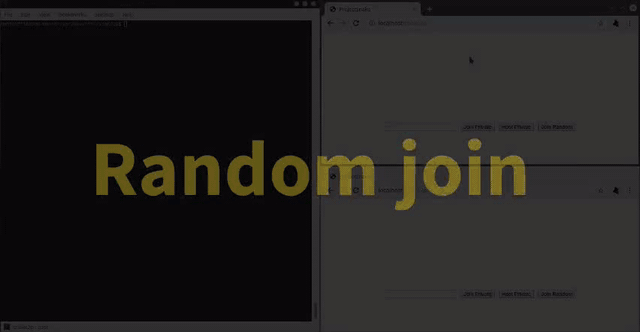

# 2Player-Online-Snake
A client-server snake game in which two players compete 1 vs 1

See brief demo below:

### Summary
Each user connects to a Node.js server via WebSocket connections (provided by the ws library). A user can choose to either join a random session, host a private session or join a private session. In any case, the server will pair all users as required&mdash;creating a dedicated session for them&mdash;and mediate all communication between them. The snakes move constantly while the users steer the them using the arrow keys. Every time a snake changes position or state, this will be communicated to the opponent. Upon crashing, a point will be granted to the opponent and the next round will start.

#### -- Please excuse my overcommented code --
